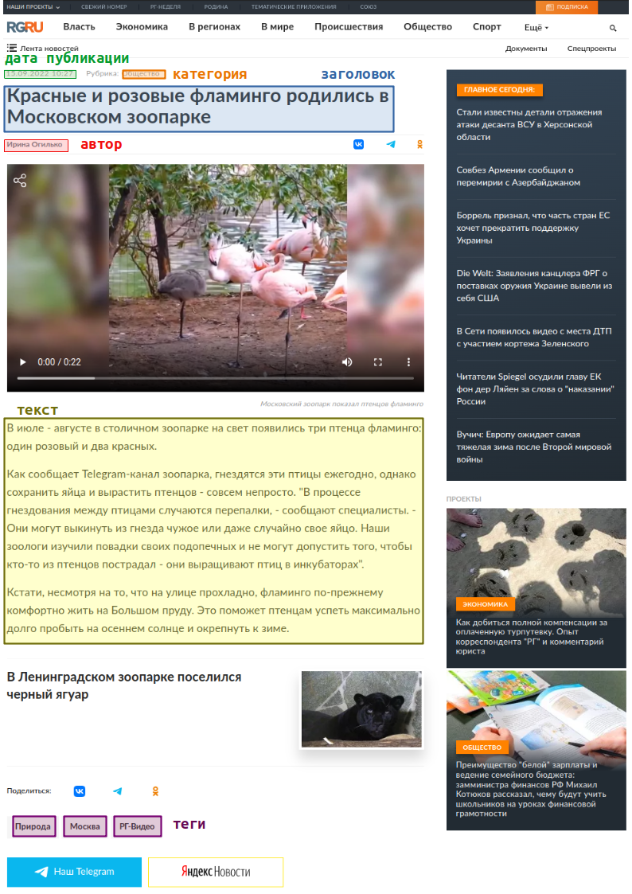
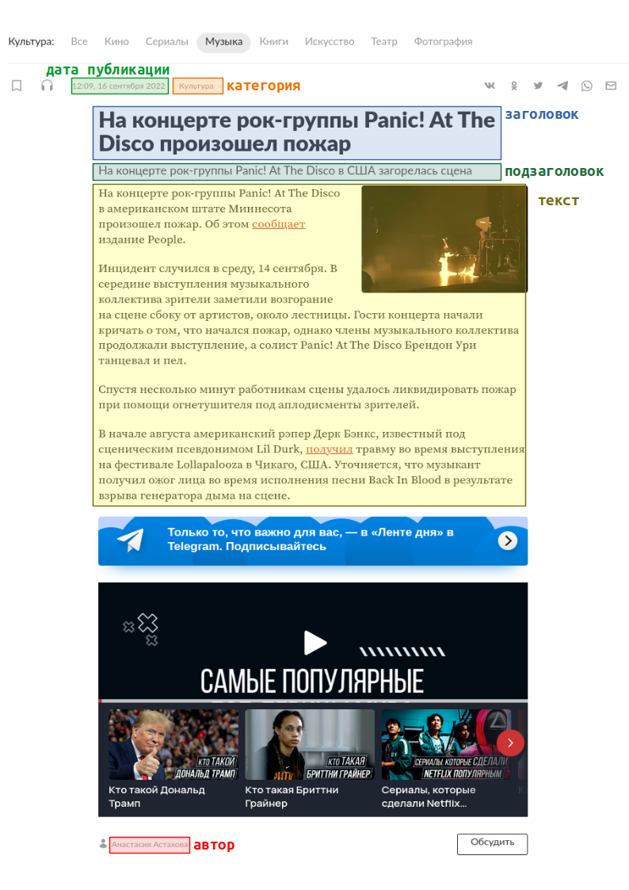
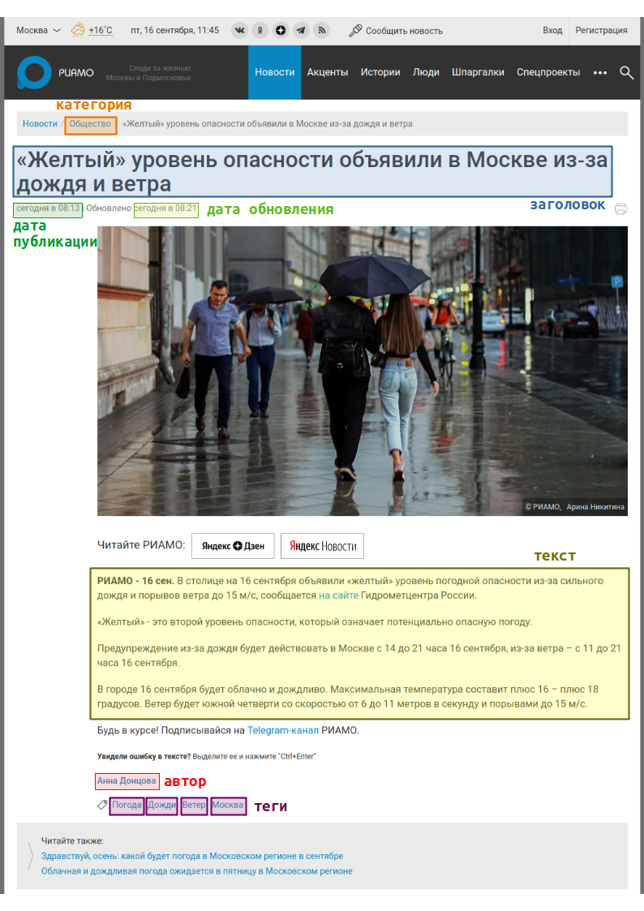
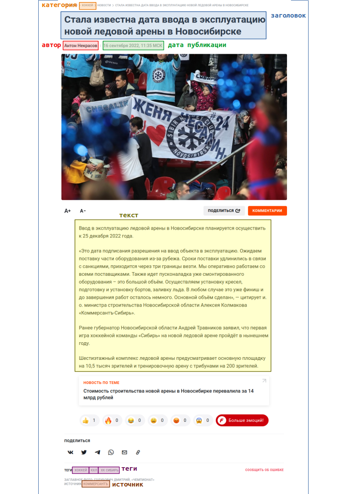
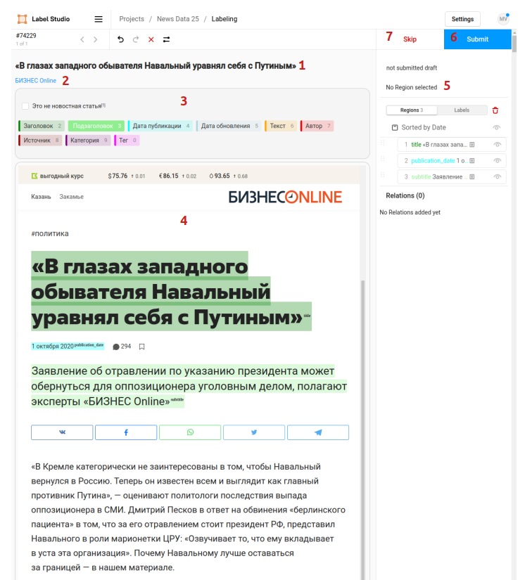

## Введение

Мы хотим научиться автоматически извлекать из веб-страниц с новостными публикациями их заголовки, тексты и другие атрибуты.
Это позволит нам улучшить качество сбора данных из сайтов СМИ в Талисмане, а также поможет в исследовании и разработке 
новых методов извлечения информации из Веба в целом, не только для новостей.
Существующие датасеты для автоизвлечения из Веба заточены на интернет-магазины (Klarna, COVA) или другие предметные 
области (SWDE), но не на новостные статьи, так что нужно разметить свой набор данных.

Нас интересуют следующие атрибуты новостных публикаций
- заголовок
- подзаголовок
- даты публикации
- дата обновления
- текст статьи
- автор(-ы) текста
- источник
- категории
- теги

В свою очередь, нас не интересуют такие атрибуты, как
- фото, видео и другие медиавложения - это связано с ограничениями текущей системы разметки
- авторы фото - т.к. мы не извлекаем фото
- число просмотров
- лайки, реакции и т.п.
- ссылки вне текста (вроде блоков "см. также")

Ниже приводится несколько примеров, как выглядят искомые атрибуты на веб-страницах (нажмите на пример, чтобы раскрыть)

Российская газета: заголовок, текст, дата публикации, автор, категория, теги

https://rg.ru/2022/09/15/krasnye-i-rozovye-flamingo-rodilis-v-moskovskom-zooparke.html

Лента: заголовок, подзаголовок, текст, дата публикации, автор, категория

https://lenta.ru/news/2022/09/16/panic/

РИАМО: заголовок, текст, дата публикации, дата обновления, автор, категория, теги

https://riamo.ru/article/583959/zheltyj-uroven-opasnosti-ob-yavili-v-moskve-iz-za-dozhdya-i-vetra-xl

Чемпионат: заголовок, текст, дата публикации, автор, категория, теги, источник

https://www.championat.com/hockey/news-4821963-v-novosibirske-nazvali-datu-vvoda-v-ekspluataciyu-novoj-ledovoj-areny.html

## Данные

Датасет содержит новостные веб-страницы, собранные с русскоязычных сайтов СМИ. 
Ссылки на эти страницы собирались в процессе периодического сбора RSS-лент с портала Яндекс.Новости в 2017-2020 годах.
В начале 2022 по этим ссылкам были скачаны сами веб-страницы.
Всего собрано около 30 тысяч страниц с 3 тысяч сайтов.
Из них мы оставили те сайты, для которых есть хотя бы по 10 страниц и страницы имеют кодировку UTF-8.

## Интерфейс разметки

В качестве инструмента разметки используется LabelStudio.

Датасет разбит на несколько проектов с именами вида News Data <номер>.
Каждому аннотатору предлагается выбрать один из этих проектов. 
При открытии проекта перед вами появится список заданий разметки (tasks), каждое из которых представляет собой разметку одной HTML страницы.
Первые 50 заданий в каждом проекте одинаковые - они нужны, чтобы оценить согласие между аннотаторами после разметки.
Эти страницы собраны с разных сайтов.
Следующие за ними задания - индивидуальные для каждого проекта.
Они сгруппированы по сайтам, по 10 заданий на сайт.
Постарайтесь разметить первые 50 страниц и столько сайтов, насколько вас хватит, желательно хотя бы 15. 

Чтобы начать разметку, нажмите Label All Tasks, либо выберите и нажмите на конкретное задание в списке.
Перед вами появится интерфейс разметки страницы.

На рисунке отмечены
1. Заголовок статьи
2. Новостное агентство (сайт), оно же - ссылка на статью 
3. Блок меток
4. Новостная страница, которую нужно размечать. На ней уже выделены заголовок, подзаголовок и дата публикации.
5. Выделенные области и метки
6. Кнопка "Сохранить аннотацию"
7. Кнопка "Пропустить задание"

Чтобы разметить значение атрибута на странице, нажмите на его метку в блоке меток, 
а затем выделите на веб-странице его текст - он должен окраситься в цвет метки, а на панели справа должна появиться
новая запись.
После выделения всех атрибутов сохраните аннотацию кнопкой Submit (6). 
Засабмиченные аннотации можно редактировать, для этого выберите страницу еще раз в списке заданий проекта.
Кнопкой Skip (7) можно пропустить задание, но старайтесь не злоупотреблять этим и размечать страницы подряд.

Попробовать систему разметки в действии до работы с основным датасетом можно в проекте Test.

## Рекомендации по разметке

Сначала необходимо убедиться, что страница перед вами действительно содержит статью.
Поскольку сбор страниц осуществлялся сильно позже индексации ссылок, часть ссылок могла устареть, и в процессе сбора
это не отлавливалось.
Например, вы можете встретить специфичную для сайта страницу 404 Not Found.
В таких случаях нужно проставить флаг "Это не новостная статья" в блоке меток и засабмитить аннотацию.
Можно также отправить пустую аннотацию, впоследствии мы удалим такие документы из конечного набора данных.

Мы не различаем в наборе данных короткие новостные статьи и длинные блогпосты, все это считается публикациями.

Если на странице несколько полных статей - то есть содержащих полный текст статьи - размечайте первую.
Такое бывает на сайтах, которые подгружают следующую статью после того, как вы дочитываете предыдущую, например, на РБК.

Если страница содержит статью, но ее содержимое частично или полностью скрыто пэйволлом, ее рекомендуется отмечать как 
не содержащую статью.

Далее для каждой метки необходимо найти и выделить ее вхождения на странице.
Общая для всех меток рекомендация такая: нужно стараться выделять текстовые блоки на странице так, чтобы в извлекаемые 
значения не попадал лишний текст.
Например, для метки "Текст" из выделенных участков должен формироваться основной текст статьи, и в него не должны
входить рекламные блоки посреди документа, подписи к изображениям, кнопки для расшаривания в соцсетях, реакции и т.п.
Для авторов не нужно выделять префикс вида "Автор:", нужно выделять сами имена авторов.
Из набора текстовых значений, извлеченных для каждой метки, должно формироваться корректное сообщение, как если бы его
сформировал человек или эталонный сборщик.
При этом не надо задумываться о том, что какой-нибудь конкретный алгоритм не сможет точно такое значение извлечь, 
это не входит в задачу аннотатора.

Для каждой метки можно выделять несколько областей на странице.
Актуально для всех меток, кроме заголовка и дат.

Поскольку Label Studio может не совсем корректно отображать страницы, рекомендуется переходить на страницу статьи по 
ссылке над блоком с метками и ориентироваться на нее при поиске значений атрибутов новости.

Ниже рекомендации для конкретных меток

*Заголовок и подзаголовки.*
С заголовком все должно быть плюс-минус понятно. 
Под подзаголовком мы понимаем блок-аннотацию между заголовком и основным текстом статьи, обычно этот блок отличается 
форматированием от обоих. 
Их может быть несколько, тогда стоит выделять каждый отдельно. 
Подзаголовки внутри текста статьи - если текст длинный и содержит разделы - размечать как подзаголовки не нужно, 
их нужно включать в текст. 

*Даты публикации и обновления.* 
Нужно выделять только сами даты, без слов вида "Опубликовано" или "Обновлено".   

*Текст статьи.*
Собственно, основное текстовое содержимое новости. 
Может состоять из нескольких частей. 
В него не нужно включать рекламу, медиавложения, ссылки на материалы, авторов, кнопки для расшаривания в соцсетях, 
призывы подписаться на СМИ в телеграме, лайки-реакции и т.п.

*Авторы.*
Меткой "Автор" надо выделять авторов текста статьи.
Авторов фото выделять не нужно.
Нужно выделять только имена авторов, без префикса вида "Автор:".

*Источник.*
Меткой "Источник" надо выделять источник текстового материала - название СМИ, ссылку на оригинал и т.п.
Префикс вида "Источник:" включать не нужно.

*Категории и теги*.
Категории - рубрики сайта, к которым относится статья, вроде "Политика" или "Общество".
Они обычно находятся в начале статьи и совпадают с разделами сайта.
Теги - ключевые слова для поиска, хэштеги и т.п.
Они обычно находятся в конце статьи и не являются разделами сайта.
И категории, и теги чаще всего являются на странице ссылками.
Теги можно отличить по наличию в URL конструкций наподобие tag/<тег>, search?q=<тег>.

Для многозначных атрибутов, таких как авторы, категории и теги, желательно выделять каждое значение 
(автор, категорию, тег) отдельной аннотацией.
Однако когда у статьи много тегов, этот процесс может быть довольно утомительным.
Поэтому для таких меток можно выделять все значения разом, одной аннотацией, если отдельные значения разделены запятыми,
или если отдельные значения находятся в отдельных элементах страницы (например, каждый тег - отдельная ссылка).

Для удобного выделения текста, содержащегося в ссылке, нужно зажать Alt. Особенно это полезно при выделении многозначных атрибутов (тегов, категорий, авторов) - они являются ссылками и расположены друг с другом неразрывно.
